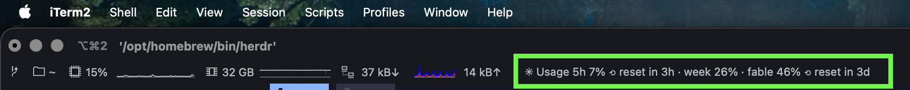
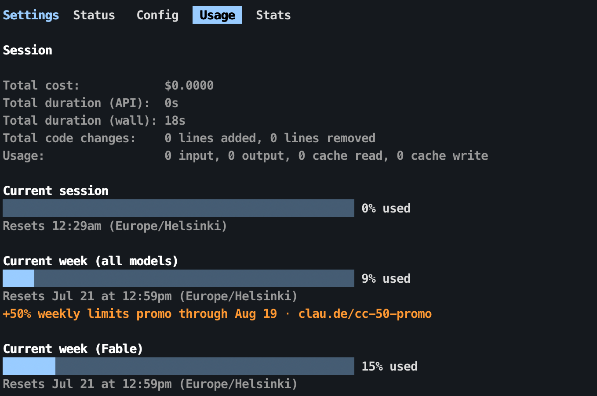
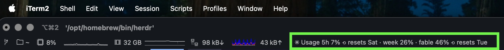
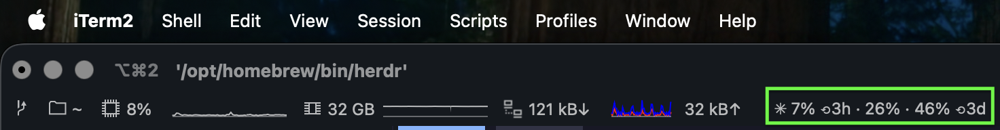
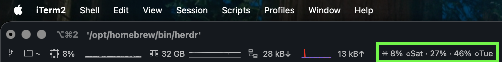
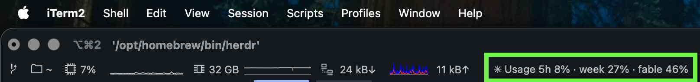
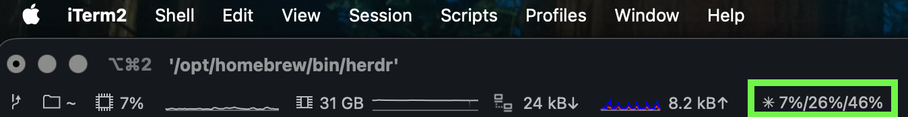

<div align="center">

# claude-usage

**Your Claude quota, live in the terminal status bar.**

The same numbers as Claude Code's `/usage` screen — the 5-hour session
window, the weekly window, and per-model weekly windows — always visible,
so you know how much quota you have left before you start something big.



```
✳ Usage 5h 8% ⟲ reset in 2h · week 10% · fable 17% ⟲ reset in 3d
```

[](LICENSE)
[](bin/claude-usage)
[](#pick-your-terminal)

</div>

## Install with AI (the easy way)

Paste this into Claude Code (or any coding agent) in your terminal:

> **Install the plugin from https://github.com/Tatendaz/claude-usage**

The agent reads [`AGENTS.md`](AGENTS.md), installs the CLI, detects which
terminal you're in, wires it up, and verifies the result. The only thing
it can't do for you is drag the widget into iTerm2's status bar — it will
tell you when.

## What you get

- **Live quota** — session + weekly + per-model windows with reset times,
  polled every 30 s through a shared 60 s cache (cheap on the API, and one
  cache feeds every terminal you use).
- **Every claude.ai plan** — Pro, Max, Team, and Enterprise seats all use
  the same window model; windows are rendered dynamically, so per-model
  buckets (like a Fable or Opus week) appear automatically when your plan
  has them.
- **Zero dependencies** — one stdlib-only Python file does credentials →
  API → cache → formatting. Everything else is a thin adapter.
- **Honest degradation** — offline shows your last good numbers marked
  `✳~`, an expired login says so, and a `!` flags any window ≥ 90 % used.

It reads the same data Claude Code renders here:



## Quick start (manual)

```bash
git clone https://github.com/Tatendaz/claude-usage.git ~/.claude-usage
cd ~/.claude-usage
./install.sh          # CLI → ~/.local/bin, iTerm2 component → AutoLaunch
claude-usage --check  # verifies credentials + endpoint end-to-end
```

Requires being logged into Claude Code with a claude.ai account (any plan).
The first Keychain access may pop a macOS dialog — click **Always Allow**.

## Pick your terminal

### iTerm2 (status bar widget)

`install.sh` already placed the component. Then, once:

1. **Settings → General → Magic → Enable Python API** (accept the Python
   runtime download if offered).
2. **Scripts → AutoLaunch → ClaudeUsage.py** to start it now (auto-starts
   with iTerm2 from then on).
3. **Settings → Profiles → Session → Status bar enabled → Configure Status
   Bar** → drag the **Claude Usage** entry you want into the row. Not
   seeing them? Scroll down — script components are listed below the
   built-in ones.

Six pre-built entries, each already previewed right there in the list —
what you see is what you drag, no knob to configure afterward:

| Entry | Looks like |
|---|---|
| Wide · Countdown (default) | `✳ Usage 5h 47% ⟲ reset in 3h · week 18% · fable 33% ⟲ reset in 6d` |
| Wide · Inline | `✳ Usage 5h 47% ⟲ resets 11pm · week 18% · fable 33% ⟲ resets Jul 28` |
| Compact · Countdown | `✳ 47% ⟲3h · 18% · 33% ⟲6d` |
| Compact · Inline | `✳ 47% ⟲11pm · 18% · 33% ⟲Jul 28` |
| Medium | `✳ Usage 5h 47% · week 18% · fable 33%` |
| Mini | `✳ 47%/18%/33%` |

<details>
<summary><strong>See each entry on a real status bar</strong> (the green box marks the component)</summary>

**Wide · Countdown** (default)


**Wide · Inline**



**Compact · Countdown**



**Compact · Inline**



**Medium**



**Mini**



</details>

In the Wide and Compact entries, every window shows when it resets — the
5-hour session and each weekly window have their own reset moments;
windows sharing one (the weeklies usually do) show it once, after the
last of them. Both come in two reset styles: **Countdown** (relative, `⟲ reset in 3h`) and
**Inline** (absolute clock time, `⟲ resets 11pm`); Medium and Mini never
show resets — there's no room at those sizes. Want `tail` (resets grouped
at the end) or Wide/Compact with resets fully `off`? Those stay available
from the CLI/tmux/starship side via `--resets` — drag Medium or Mini here
for the iTerm2 equivalent of off.

Already had **Claude Usage** in your status bar before this update? It's
now **Wide · Countdown** — same identifier, nothing to re-add.

### tmux

With [TPM](https://github.com/tmux-plugins/tpm):

```tmux
set -g @plugin 'Tatendaz/claude-usage'
set -g status-right '#{claude_usage} | %H:%M '
set -g status-interval 30
```

Without TPM:

```tmux
set -g status-right '#(~/.local/bin/claude-usage --format tmux) | %H:%M '
set -g status-interval 30
```

The tmux format colors each window green / yellow / red as it fills.

### WezTerm

```bash
cp ~/.claude-usage/wezterm/claude-usage.lua ~/.config/wezterm/claude-usage.lua
```

```lua
-- wezterm.lua
require('claude-usage').setup()
-- or, if you already render your own right status:
--   my_status = require('claude-usage').text()
```

### kitty (experimental)

kitty has no status bar, so this draws the quota at the right edge of the
tab bar (the community custom-tab-bar pattern):

```bash
cp ~/.claude-usage/kitty/tab_bar.py ~/.config/kitty/tab_bar.py
```

```conf
# kitty.conf
tab_bar_style custom
tab_bar_min_tabs 1
```

Already have a custom `tab_bar.py`? Merge `status_text`, `find_core`, and
`_draw_right_status` into it instead of overwriting.

### starship

```toml
# ~/.config/starship.toml
[custom.claude_usage]
command = "~/.local/bin/claude-usage"
when = true
format = "[$output]($style) "
```

### Plain zsh (works in any terminal)

```zsh
# ~/.zshrc
claude_usage_rprompt() { RPROMPT="$(~/.local/bin/claude-usage 2>/dev/null)" }
precmd_functions+=(claude_usage_rprompt)
```

### Claude Code statusline

Merge this key into `~/.claude/settings.json` (keep your existing keys):

```json
{ "statusLine": { "type": "command", "command": "~/.local/bin/claude-usage" } }
```

## CLI reference

```
claude-usage [--format text|iterm|tmux|long|json] [--remaining]
             [--resets countdown|inline|tail|off] [--width wide|medium|compact|mini]
             [--buckets LIST] [--all] [--ttl N] [--force] [--check] [--demo]
```

| Flag | What it does |
|---|---|
| `--format long` | `/usage`-style panel with bars and reset times |
| `--format json` | machine-readable buckets + raw API response |
| `--remaining` | show quota **left** instead of used |
| `--resets countdown` | reset style: `countdown` (`⟲ reset in 3h`), `inline` (`⟲ resets 11pm`), `tail` (grouped at the end), `off`. Default: countdown in `iterm`, off elsewhere |
| `--width wide` | print one fixed iTerm2 size instead of the full width ladder: `wide`, `medium`, `compact`, `mini` (`--format iterm` only). `wide`/`compact` honor `--resets`; `medium`/`mini` never show resets. This is what the six iTerm2 picker entries use internally |
| `--buckets session,weekly_all` | choose which windows to show (key or label) |
| `--ttl 60` / `--force` | cache lifetime / bypass the cache |
| `--check` | verbose self-check (credentials, token, endpoint, windows) |
| `--demo` | render sample data — no credentials or network needed |

Environment: `CLAUDE_USAGE_TTL`, `CLAUDE_USAGE_ICON`, `CLAUDE_USAGE_TITLE`
(set to `""` to hide the word "Usage"), `CLAUDE_USAGE_RESETS` (default
reset style for every format — handy for tmux/starship/zsh, which have no
flag of their own in your config), `CLAUDE_USAGE_RESET_LABEL` (word after
the ⟲ icon; default "reset in" for countdowns, "resets" otherwise, `""`
for the bare icon), `CLAUDE_USAGE_BIN` (path override for components),
`CLAUDE_USAGE_DEBUG=1`.

```
$ claude-usage --format long
Claude usage  (updated 12s ago)
Current session            ██░░░░░░░░░░░░░░░░░░░░░░   8% used
                            resets 12:30am (in 2h)
Current week (all models)  ██░░░░░░░░░░░░░░░░░░░░░░  10% used
                            resets Jul 21 1:00pm (in 3d)
Current week (Fable)       ████░░░░░░░░░░░░░░░░░░░░  17% used
                            resets Jul 21 1:00pm (in 3d)
```

## For AI agents

[`AGENTS.md`](AGENTS.md) is written for you: an install runbook (terminal
detection, per-terminal wiring, verification, what to report back) and a
JSON contract. Two highlights:

- `claude-usage --format json` gives `percent_left` per window — agents
  can check it before starting token-heavy work and pace themselves.
- Exit code is 0 even without data (status bars must not break); use the
  JSON `error` field. Only `--check` signals via exit code.

## How it works

1. **Credentials** (first match wins): `$CLAUDE_USAGE_TOKEN` →
   `$CLAUDE_CODE_OAUTH_TOKEN` (from `claude setup-token`) → macOS Keychain
   item `Claude Code-credentials` → `~/.claude/.credentials.json`. The
   token is never printed, logged, or stored anywhere new.
2. **One request** to `api.anthropic.com/api/oauth/usage` — the endpoint
   Claude Code's own `/usage` screen uses — with the OAuth bearer token,
   the `anthropic-beta: oauth-2025-04-20` header, and a
   `claude-code/<installed version>` User-Agent (unrecognized clients get
   aggressively rate-limited).
3. **Parsing** prefers the modern `limits` array (`session`, `weekly_all`,
   and `weekly_scoped` entries carrying per-model windows like Fable) and
   falls back to the legacy top-level `five_hour`/`seven_day*` buckets,
   auto-detecting whether utilization arrives as 0–1 or 0–100. Extra
   usage credits (`spend`) appear as a `credits` bucket when enabled.
4. **Cache** in `~/.cache/claude-usage/` for 60 s, shared by every status
   bar; on errors the last good data is served and marked stale after
   5 minutes.

**Caveat:** the endpoint is undocumented. When Anthropic changes it, the
bar degrades to `✳ n/a` rather than breaking your terminal; `--check` and
`--format json` (the `raw` field) show exactly what came back, and
`normalize()` in `bin/claude-usage` is where to teach it new shapes.

## Troubleshooting

| Symptom | Meaning / fix |
|---|---|
| `✳ not logged in` | Log into Claude Code (`claude`) with a claude.ai account, or export `CLAUDE_CODE_OAUTH_TOKEN`. API-key/Bedrock/Vertex setups have no quota to show. |
| `✳ login expired — open claude` | The OAuth token expired; opening any `claude` session refreshes it. This tool deliberately never refreshes tokens itself (refresh tokens rotate — racing Claude Code could log you out). |
| `✳~ …` | API unreachable; showing your last good numbers. |
| `✳ rate-limited, retrying` | HTTP 429 from the endpoint; it backs off through the cache. |
| Keychain dialog every refresh | Click **Always Allow** (not "Allow") for "Claude Code-credentials". |
| Widget missing in iTerm2 | Python API enabled? Script running (Scripts → AutoLaunch)? Component dragged into the status bar layout? Scrolled to the bottom of the component menu (script components are listed after the built-ins)? |

## Development

```bash
python3 -m unittest discover -s tests -v   # no network, no Keychain
./bin/claude-usage --demo --format long    # exercise formats on sample data
```

PRs run a CI gate: tests, new-code-needs-new-tests, and docs entries under
`docs/features/` + `docs/summaries/`. See [CONTRIBUTING.md](CONTRIBUTING.md).

## Uninstall

```bash
./uninstall.sh   # removes the CLI link, iTerm2 component, and cache
```

---

If this plugin is useful, consider leaving a ⭐ — it helps others find it.

MIT © [Tatendaz](https://github.com/Tatendaz)
