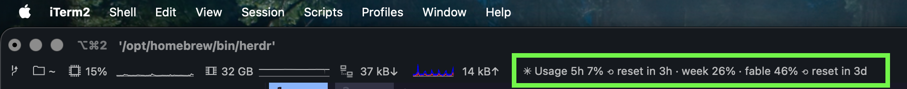
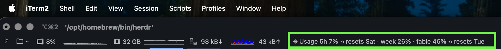
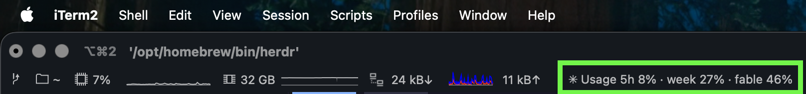
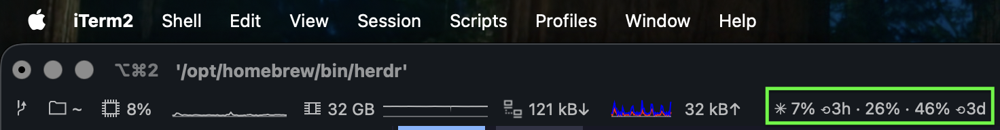
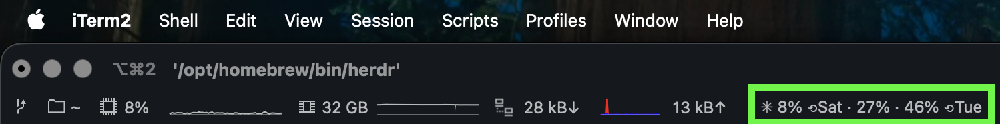
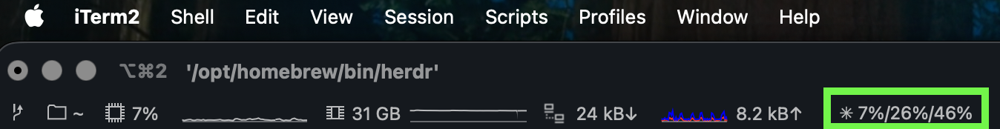

<div align="center">

# 🕐 claude-usage

**Your Claude quota, live in the terminal status bar.**

The same numbers as Claude Code's `/usage` screen — the 5-hour session
window, the weekly window, and per-model weekly windows — always visible,
so you know how much quota you have left before you start something big.



```
✳ Usage 5h 8% ⟲ reset in 2h · week 10% · fable 17% ⟲ reset in 3d
```

[](LICENSE)
[](bin/claude-usage)
[](docs/TERMINALS.md)

</div>

## Install

**With an AI agent** — paste this into Claude Code (or any coding agent):

> **Install the plugin from https://github.com/Tatendaz/claude-usage**

It reads [`AGENTS.md`](AGENTS.md), installs the CLI, detects your terminal,
wires it up, and verifies the result. The only thing it can't do is drag the
widget into iTerm2's status bar — it will tell you when.

**By hand:**

```bash
git clone https://github.com/Tatendaz/claude-usage.git ~/.claude-usage
cd ~/.claude-usage
./install.sh          # CLI → ~/.local/bin, iTerm2 component → AutoLaunch
claude-usage --check  # verifies credentials + endpoint end-to-end
```

Requires being logged into Claude Code with a claude.ai account (any plan —
Pro, Max, Team, Enterprise). The first Keychain access may pop a macOS
dialog: click **Always Allow**.

## What you get

- **Live quota** — session, weekly, and per-model windows with reset times,
  polled every 30 s through a shared 60 s cache. One cache feeds every
  terminal you use.
- **Every claude.ai plan** — windows render dynamically, so per-model buckets
  (a Fable or Opus week) appear automatically when your plan has them.
- **Zero dependencies** — one stdlib-only Python file. Everything else is a
  thin adapter.
- **Honest degradation** — offline shows your last good numbers marked `✳~`,
  an expired login says so, and `!` flags any window ≥ 90 % used.

## Pick your look (iTerm2)

`install.sh` already placed the component. Then, once:

1. **Settings → General → Magic → Enable Python API** (accept the Python
   runtime download if offered).
2. **Scripts → AutoLaunch → ClaudeUsage.py** to start it now (auto-starts
   with iTerm2 from then on).
3. **Settings → Profiles → Session → Status bar enabled → Configure Status
   Bar** → drag the **Claude Usage** entry you want into the row. Not seeing
   them? Scroll down — script components sit below the built-in ones.

Six ready-made entries, previewed right where you drag them from. Every
capture below is a real status bar; the green outline marks the component.
Widest first:

**Wide · Countdown** — the default. Labels, percentages, and how long until
each window resets.


**Wide · Inline** — same information, but resets as wall-clock times
(`⟲ resets 11pm`) instead of countdowns.



**Medium** — labels and percentages, no reset times.



**Compact · Countdown** — drops the labels and the word "Usage", keeping
percentages and bare countdown marks (`47% ⟲3h`). About a third the width of
Wide.



**Compact · Inline** — the compact layout with clock times.



**Mini** — three percentages and nothing else, for a bar that's already full.



In Wide and Compact, every window shows its own reset; windows that share one
(the weeklies usually do) show it once, after the last of them. Medium and
Mini never show resets — no room. Two more styles, `tail` and full-width
`off`, are available outside the picker via `--resets` — see
[the CLI reference](docs/CLI.md).

*Upgrading from v1.0.0 and already had **Claude Usage** in your bar? It's
**Wide · Countdown** now — same identifier, nothing to re-add.*

## Other terminals

tmux, WezTerm, kitty, starship, plain zsh, and the Claude Code statusline are
each a two-line setup — see **[docs/TERMINALS.md](docs/TERMINALS.md)**.

## Documentation

| | |
|---|---|
| [CLI reference](docs/CLI.md) | every flag, environment variable, and output format |
| [Terminal setup](docs/TERMINALS.md) | tmux, WezTerm, kitty, starship, zsh, statusline |
| [How it works](docs/HOW_IT_WORKS.md) | credentials, the endpoint, parsing, caching |
| [Troubleshooting](docs/TROUBLESHOOTING.md) | what each `✳` message means and how to fix it |
| [AGENTS.md](AGENTS.md) | install runbook and JSON contract, written for AI agents |
| [CONTRIBUTING.md](CONTRIBUTING.md) | tests, docs gate, and the stdlib-only rule |

## Uninstall

```bash
./uninstall.sh   # removes the CLI link, iTerm2 component, and cache
```

---

If this plugin is useful, consider leaving a ⭐ — it helps others find it.

MIT © [Tatendaz](https://github.com/Tatendaz)
