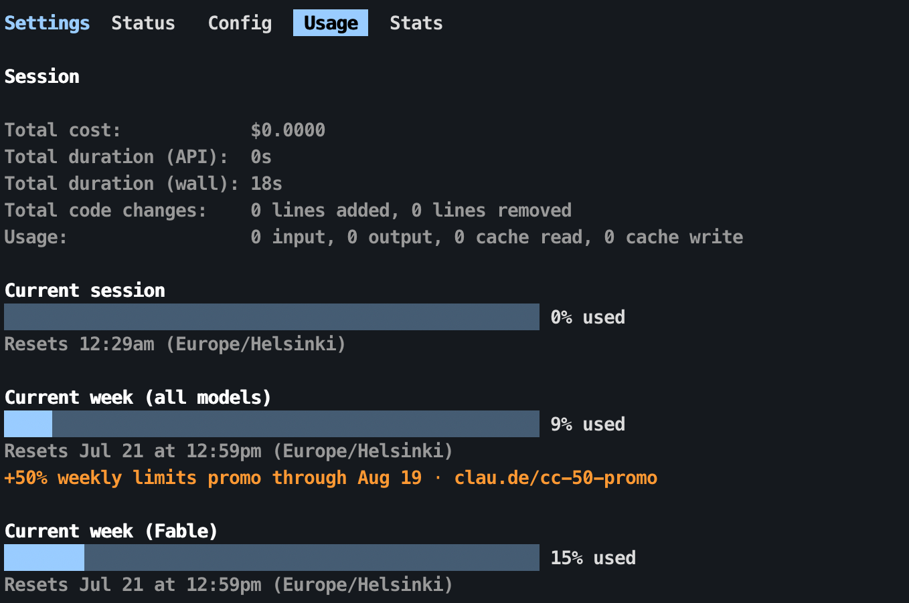

# How it works

It reads the same data Claude Code renders here:

1. **Credentials** (first match wins): `$CLAUDE_USAGE_TOKEN` →
   `$CLAUDE_CODE_OAUTH_TOKEN` (from `claude setup-token`) → macOS Keychain
   item `Claude Code-credentials` → `~/.claude/.credentials.json`. The token
   is never printed, logged, or stored anywhere new.
2. **One request** to `api.anthropic.com/api/oauth/usage` — the endpoint
   Claude Code's own `/usage` screen uses — with the OAuth bearer token, the
   `anthropic-beta: oauth-2025-04-20` header, and a
   `claude-code/<installed version>` User-Agent (unrecognized clients get
   aggressively rate-limited). Redirects are rejected.
3. **Parsing** prefers the modern `limits` array (`session`, `weekly_all`, and
   `weekly_scoped` entries carrying per-model windows like Fable) and falls
   back to the legacy top-level `five_hour`/`seven_day*` buckets,
   auto-detecting whether utilization arrives as 0–1 or 0–100. Extra usage
   credits (`spend`) appear as a `credits` bucket when enabled.
4. **Cache** in `~/.cache/claude-usage/` for 60 s by default — `CLAUDE_USAGE_TTL`
   and `--ttl N` both change that — shared by every status bar; on errors the
   last good data is served and marked stale after 5 minutes. Only allowlisted
   quota fields are persisted; old raw caches are sanitized on their next read.
   API error bodies are never logged.

## Caveat: the endpoint is undocumented

When Anthropic changes it, the bar degrades to `✳ n/a` rather than breaking
your terminal. `--check` and `--format json` show only allowlisted quota fields,
including in the compatibility field named `raw`. `quota_data()` and
`normalize()` in `bin/claude-usage` are where to add supported response fields
and shapes. Full API responses are not retained.

If you're fixing a drift, regression tests go alongside `normalize()` /
`_from_limits()` / `_from_legacy()` with an **anonymized** payload —
percentages only, with anything account-identifying stripped out of the
`--format json` output before pasting. See [CONTRIBUTING.md](../CONTRIBUTING.md).

See also: [CLI reference](CLI.md) · [Troubleshooting](TROUBLESHOOTING.md)
